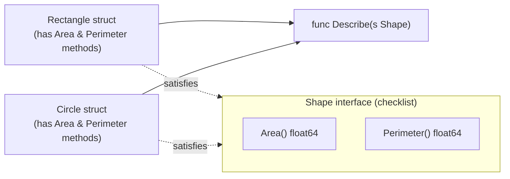

# Interfaces in Go

## Explanation

An **interface** defines a set of method signatures — a contract of behavior, with no implementation.

```go
type Shape interface {
    Area() float64
    Perimeter() float64
}
```

Any type that has methods matching *all* of an interface's signatures automatically satisfies that interface. **There is no `implements` keyword** — Go uses **structural typing** ("duck typing at compile time"): if it has the right methods, it qualifies.

```go
type Rectangle struct {
    Width, Height float64
}

func (r Rectangle) Area() float64      { return r.Width * r.Height }
func (r Rectangle) Perimeter() float64 { return 2 * (r.Width + r.Height) }

// Rectangle automatically satisfies Shape — nothing extra needed.
```

### Why interfaces matter

They let you write functions that work with *any* type satisfying a behavior, instead of one hardcoded concrete type:

```go
func Describe(s Shape) {
    fmt.Println("Area:", s.Area())
}

Describe(Rectangle{Width: 4, Height: 5}) // works
Describe(Circle{Radius: 3})              // also works, if Circle implements Shape
```

This is how Go achieves polymorphism without classical inheritance.

### The empty interface `interface{}` / `any`

An interface with zero methods is satisfied by **every** type:

```go
func PrintAnything(v interface{}) { // or: func PrintAnything(v any)
    fmt.Println(v)
}
```

Used sparingly — it sacrifices type safety, common in generic-looking code before Go added real generics (Go 1.18+).

### Type assertions and type switches

Given an interface value, you can recover the concrete type underneath:

```go
var s Shape = Rectangle{Width: 2, Height: 3}

r, ok := s.(Rectangle) // type assertion; ok=false if it's not actually a Rectangle
if ok {
    fmt.Println(r.Width)
}

switch v := s.(type) {
case Rectangle:
    fmt.Println("It's a rectangle", v.Width)
case Circle:
    fmt.Println("It's a circle", v.Radius)
default:
    fmt.Println("Unknown shape")
}
```

### Interfaces are satisfied implicitly and often small

Idiomatic Go favors small interfaces (1–2 methods), like the standard library's `io.Reader`:

```go
type Reader interface {
    Read(p []byte) (n int, err error)
}
```

Any type with a matching `Read` method — files, network connections, buffers — can be passed anywhere an `io.Reader` is expected.

## Simplified

An interface is a **checklist of abilities**, not a family tree. If a type can do everything on the checklist, it counts as satisfying that interface — no need to declare it anywhere. It's like saying "anything that can `Fly()` and `Land()` counts as an Aircraft," and then a `Plane`, `Helicopter`, or even a `Drone` all qualify automatically, just by having those methods.

## Diagram


