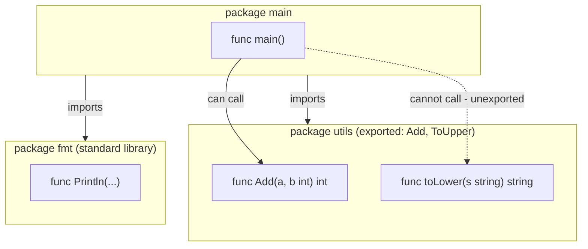

# Packages in Go

## Explanation

Every Go file belongs to a **package**. A package is just a folder of `.go` files that share a name declared at the top of each file:

```go
package main
```

Go programs are built from packages layered on top of each other:

- **`main` package** — this is special. It marks an executable program (as opposed to a library). It must contain a `func main()`, which is the entry point that runs when you execute the program.
- **Library packages** — any other package name (e.g. `package utils`) is a reusable library. It has no `main()` function and can't be run on its own; other packages import it.

### Importing packages

```go
import (
    "fmt"          // standard library package
    "math/rand"    // nested standard library package
    "github.com/you/yourrepo/utils" // your own package, identified by module path
)
```

Go resolves imports through **modules**, defined by a `go.mod` file at the root of your repo:

```
module github.com/you/go-learning

go 1.22
```

Once this exists, any folder inside your repo with `.go` files is automatically an importable package, addressed by its path relative to the module root.

### Exported vs unexported names

Go doesn't have `public`/`private` keywords. Instead, **capitalization controls visibility**:

- `func DoThing()` — starts with a capital letter → **exported**, visible outside the package.
- `func doThing()` — starts with lowercase → **unexported**, only visible inside the same package.

This applies to functions, types, struct fields, constants, and variables alike.

```go
package account

type Account struct {
    Balance float64 // exported: outside code can read/write this
    pin     string  // unexported: hidden from other packages
}
```

### Package initialization

Each package can have an `init()` function that runs automatically before `main()`, useful for one-time setup (registering drivers, validating config, etc.). You can have multiple `init()` functions, even across multiple files in the same package — Go runs them all in file-name order.

## Simplified

Think of a package as a **labeled toolbox**. Every Go file says which toolbox it belongs to (`package X`). One special toolbox, `main`, is the one you actually plug in and run — it needs a `main()` tool inside it as the "on switch." Any name inside a toolbox that starts with a **capital letter** is visible from outside the box; lowercase names are the toolbox's own private tools that nobody else can borrow.

## Diagram


