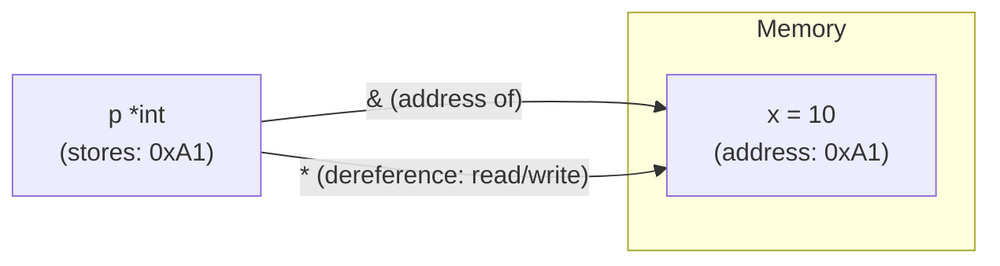

# Pointers in Go

## Explanation

A **pointer** is a variable that stores the memory address of another variable, instead of a value itself.

Two operators:

- `&x` — "address of x" → gives you a pointer to `x`.
- `*p` — "dereference p" → gives you the value stored at the address `p` points to.

```go
x := 10
p := &x        // p is of type *int, holding the address of x
fmt.Println(*p) // 10 — the value at that address

*p = 20        // writes through the pointer
fmt.Println(x) // 20 — x itself changed!
```

### Why pointers exist: pass-by-value in Go

Go always passes arguments **by value** — function parameters are copies. Without pointers, a function can't modify the caller's variable:

```go
func increment(n int) {
    n++ // modifies the local copy only
}

func incrementPtr(n *int) {
    *n++ // modifies the original
}

x := 5
increment(x)
fmt.Println(x) // still 5

incrementPtr(&x)
fmt.Println(x) // 6
```

This matters a lot for structs — passing a large struct by value copies the whole thing; passing `*Struct` passes just an address (cheap, and allows mutation).

```go
type Counter struct{ Count int }

func (c *Counter) Increment() { c.Count++ } // pointer receiver — needed to mutate

c := Counter{}
c.Increment() // Go automatically takes &c here
fmt.Println(c.Count) // 1
```

### nil pointers

A pointer's zero value is `nil` — it points to nothing. Dereferencing a `nil` pointer panics at runtime:

```go
var p *int
fmt.Println(*p) // panic: nil pointer dereference
```

Always check `if p != nil` before dereferencing an unverified pointer.

### `new()` vs `&Struct{}`

```go
p1 := new(int)       // allocates a zeroed int, returns *int
p2 := &MyStruct{}     // allocates a zeroed MyStruct, returns *MyStruct
```

Both are common; `&Struct{...}` is more idiomatic when you're also setting fields.

## Simplified

Imagine a value is a house, and a pointer is a **piece of paper with the house's address written on it**. If you hand someone the house itself (pass by value), they get their own copy to mess with — your original house is untouched. If you hand them the address (pass by pointer), they can walk to your actual house and repaint it. `&` means "write down this address," `*` means "go to this address and look/act on what's there."

## Diagram


