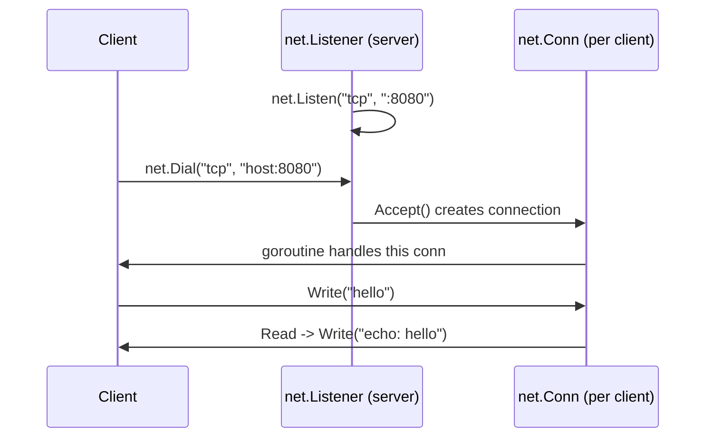

# The `net` Package

## Explanation

`net` is Go's standard library package for low-level networking: TCP, UDP, Unix sockets, and DNS resolution. (Note: `net/http`, which builds HTTP servers/clients on top of `net`, is a separate, higher-level package.)

### Core concepts

- **`net.Conn`** — a generic interface representing an open network connection, with `Read`, `Write`, and `Close` methods. It's implemented by TCP connections, Unix socket connections, etc. Code written against `net.Conn` works regardless of the underlying transport.
- **`net.Listener`** — represents a server socket waiting for incoming connections.

### A minimal TCP server

```go
listener, err := net.Listen("tcp", ":8080")
if err != nil {
    log.Fatal(err)
}
defer listener.Close()

for {
    conn, err := listener.Accept() // blocks until a client connects
    if err != nil {
        continue
    }
    go handleConn(conn) // handle each client concurrently
}

func handleConn(conn net.Conn) {
    defer conn.Close()
    buf := make([]byte, 1024)
    n, err := conn.Read(buf)
    if err != nil {
        return
    }
    conn.Write([]byte("echo: " + string(buf[:n])))
}
```

### A minimal TCP client

```go
conn, err := net.Dial("tcp", "localhost:8080")
if err != nil {
    log.Fatal(err)
}
defer conn.Close()

conn.Write([]byte("hello server"))

buf := make([]byte, 1024)
n, _ := conn.Read(buf)
fmt.Println(string(buf[:n]))
```

### Key functions

| Function | Purpose |
|---|---|
| `net.Listen(network, address)` | Start listening for connections (server side) |
| `net.Dial(network, address)` | Open a connection to a remote address (client side) |
| `net.LookupHost(host)` | Resolve a hostname to IP addresses |
| `net.ParseIP(s)` | Parse a string into an `net.IP` |

`network` is typically `"tcp"`, `"tcp4"`, `"tcp6"`, `"udp"`, or `"unix"`.

### Why `go handleConn(conn)` matters

Each accepted connection is handled in its own **goroutine**, so the server can serve many clients concurrently without blocking on one slow client — this pattern is central to how Go network servers scale.

## Simplified

`net` is the toolkit for talking over raw network connections — think of it as the plumbing underneath things like web servers. `net.Listen` sets up a phone that waits for calls; `Accept()` picks up when someone calls; `net.Dial` is you making the call yourself. Once connected, both sides just `Read` and `Write` bytes back and forth, like passing notes through a pipe.

## Diagram


