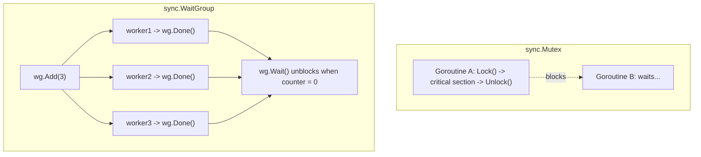

# The `sync` Package

## Explanation

`sync` provides low-level primitives for coordinating goroutines that share memory. Go's philosophy is "don't communicate by sharing memory; share memory by communicating" (i.e. prefer channels) — but `sync` is essential when channels are overkill, or for protecting a single shared resource like a map or counter.

### `sync.Mutex` — mutual exclusion lock

Protects a shared resource so only one goroutine touches it at a time:

```go
type SafeCounter struct {
    mu    sync.Mutex
    count int
}

func (c *SafeCounter) Increment() {
    c.mu.Lock()
    defer c.mu.Unlock()
    c.count++
}
```

Without the lock, concurrent goroutines calling `Increment()` could race — reading and writing `count` at the same time, corrupting the result. `Lock()` blocks until it can acquire the lock; `Unlock()` releases it. Always pair them, ideally with `defer Unlock()` right after `Lock()`.

### `sync.RWMutex` — reader/writer lock

Allows multiple concurrent readers, but only one writer, and no readers while writing:

```go
var mu sync.RWMutex
var data map[string]string

func Read(key string) string {
    mu.RLock()
    defer mu.RUnlock()
    return data[key]
}

func Write(key, value string) {
    mu.Lock()
    defer mu.Unlock()
    data[key] = value
}
```

Use this when reads vastly outnumber writes — it improves throughput over a plain `Mutex`.

### `sync.WaitGroup` — wait for goroutines to finish

```go
var wg sync.WaitGroup

for i := 0; i < 5; i++ {
    wg.Add(1) // register one goroutine to wait for
    go func(n int) {
        defer wg.Done() // signal completion
        fmt.Println("worker", n)
    }(i)
}

wg.Wait() // blocks until all 5 have called Done()
fmt.Println("all workers finished")
```

`Add` increments a counter, `Done` decrements it, `Wait` blocks until it hits zero.

### `sync.Once` — run exactly once

```go
var once sync.Once

func setup() {
    fmt.Println("initializing...")
}

func GetConfig() {
    once.Do(setup) // setup() runs only on the very first call, ever
}
```

Common for lazy-initializing a singleton (e.g. a database connection) safely across concurrent callers.

### Common pitfall

Copying a struct that contains a `sync.Mutex` (or `WaitGroup`) copies the lock state too, which breaks synchronization. `go vet` warns about this — always pass such structs by pointer.

## Simplified

`sync` gives goroutines traffic-control tools so they don't collide while sharing something. `Mutex` is a single bathroom key — only one goroutine holds it at a time. `RWMutex` is a library reading room — many people can read at once, but if someone needs to rearrange the shelves (write), everyone else waits. `WaitGroup` is a checklist — you register how many workers you're waiting on, each checks off when done, and you wait until the list is empty. `Once` is a "only flip this switch one time, ever" guarantee, even if many goroutines try at once.

## Diagram


