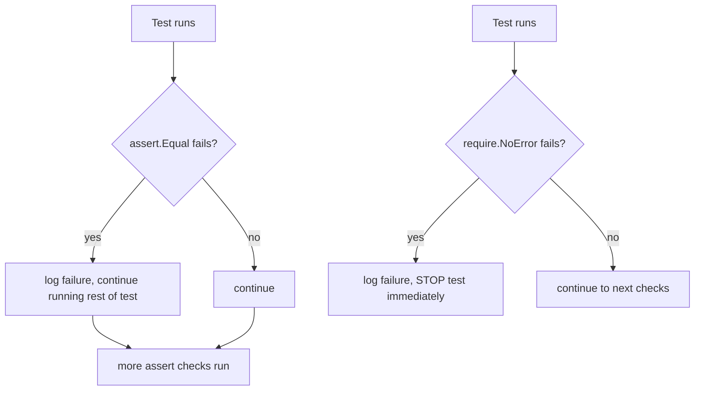

# Assertions in Go Testing

## Explanation

Go's standard `testing` package deliberately has **no built-in `assert` function**. This is a language design choice, not an oversight — idiomatic Go tests use plain `if` checks plus `t.Errorf`/`t.Fatalf`, because it keeps error messages fully explicit and avoids "magic" macro-like behavior.

```go
// Idiomatic "manual assertion" style
if got != want {
    t.Errorf("got %v, want %v", got, want)
}
```

### Why people still reach for an assert library

Manual checks get verbose fast when testing many conditions (equality, nil checks, error checks, slice/map equality, panics). The community-standard solution is the third-party package **`github.com/stretchr/testify/assert`**.

```go
import "github.com/stretchr/testify/assert"

func TestAdd(t *testing.T) {
    result := Add(2, 3)
    assert.Equal(t, 5, result, "Add(2,3) should be 5")
}
```

Common `testify/assert` functions:

| Function | Purpose |
|---|---|
| `assert.Equal(t, want, got)` | Deep equality check |
| `assert.NoError(t, err)` | Fails if err != nil |
| `assert.Nil(t, obj)` / `assert.NotNil(t, obj)` | Nil checks |
| `assert.True(t, cond)` / `assert.False(t, cond)` | Boolean checks |
| `assert.Len(t, slice, n)` | Checks length |
| `assert.Contains(t, slice, item)` | Membership check |

### `assert` vs `require`

`testify` also has a `require` package with the **same function names**, but with one crucial difference:

- `assert.Equal(...)` — logs a failure but the test function **keeps running**.
- `require.Equal(...)` — logs a failure and **immediately stops** the test function (like `t.Fatalf`).

Use `require` for a precondition where continuing would be meaningless or cause a panic (e.g. asserting a returned pointer isn't `nil` before dereferencing it), and `assert` for independent checks where you want to see all failures in one run.

```go
resp, err := http.Get(url)
require.NoError(t, err)      // stop here if this fails — resp may be nil
require.NotNil(t, resp)

assert.Equal(t, 200, resp.StatusCode) // independent checks after that point
assert.Contains(t, resp.Header, "Content-Type")
```

## Simplified

Go doesn't ship a built-in "assert" — you're expected to just write `if` statements and report failures yourself, which keeps things transparent. Most people still bring in the `testify` library for convenience: `assert.X` checks something and keeps going even if it fails (so you see every problem at once), while `require.X` checks something and stops immediately if it's wrong (used when continuing wouldn't make sense, like using a `nil` result).

## Diagram


