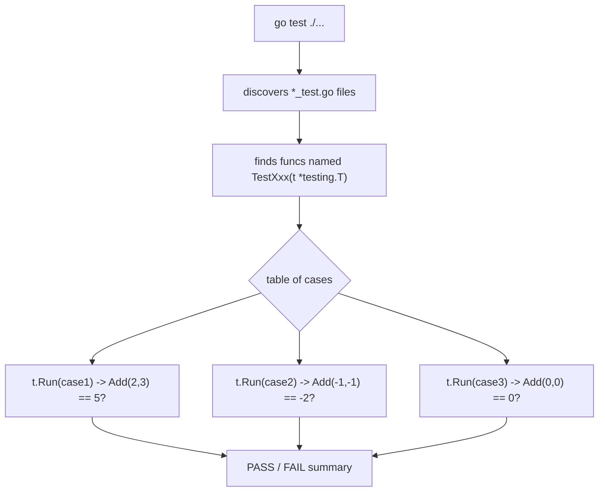

# The `testing` Package

## Explanation

Go has first-class testing built into the toolchain via the `testing` package — no separate framework required to get started.

### File and function conventions

- Test files are named `xxx_test.go`, living alongside the code they test.
- Test functions are named `TestXxx(t *testing.T)` — must start with `Test`, take `*testing.T`, capital letter right after "Test".

```go
// math.go
package mathutil

func Add(a, b int) int { return a + b }
```

```go
// math_test.go
package mathutil

import "testing"

func TestAdd(t *testing.T) {
    result := Add(2, 3)
    if result != 5 {
        t.Errorf("Add(2, 3) = %d; want 5", result)
    }
}
```

Run with:

```
go test ./...
```

### `t.Errorf` vs `t.Fatalf`

- `t.Errorf` — marks the test as failed but keeps executing the rest of the function.
- `t.Fatalf` — marks it failed and immediately stops the current test function (useful when a later line would panic otherwise, e.g. a nil pointer from a failed setup step).

### Table-driven tests

The idiomatic Go way to test many input/output cases without duplicating code:

```go
func TestAdd(t *testing.T) {
    cases := []struct {
        name     string
        a, b     int
        expected int
    }{
        {"positive numbers", 2, 3, 5},
        {"negative numbers", -1, -1, -2},
        {"zero", 0, 0, 0},
    }

    for _, tc := range cases {
        t.Run(tc.name, func(t *testing.T) {
            got := Add(tc.a, tc.b)
            if got != tc.expected {
                t.Errorf("Add(%d, %d) = %d; want %d", tc.a, tc.b, got, tc.expected)
            }
        })
    }
}
```

`t.Run` creates a named subtest — failures report which specific case failed, and `go test -run TestAdd/negative_numbers` can target just one.

### Benchmarks

```go
func BenchmarkAdd(b *testing.B) {
    for i := 0; i < b.N; i++ {
        Add(2, 3)
    }
}
```

Run with `go test -bench=.` — Go automatically adjusts `b.N` to run long enough for a stable measurement.

### Setup/teardown

```go
func TestMain(m *testing.M) {
    setup()
    code := m.Run()
    teardown()
    os.Exit(code)
}
```

`TestMain`, if present, wraps the entire test run for a package — useful for spinning up a test database once instead of per-test.

## Simplified

Go's `testing` package is a built-in judge for your code: you write functions named `TestSomething`, feed in inputs, and check whether the output matches what you expected using `t.Errorf` if it doesn't. Table-driven tests are just a spreadsheet of test cases run through one loop, so you don't copy-paste the same check over and over. `go test` runs the whole suite and tells you pass/fail.

## Diagram


